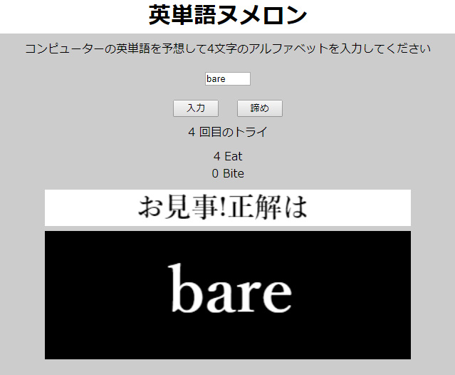

# 4 Letter Word Guess
In this program I attmped to create the word guessing game (英単語ヌメロン).

This was inspired by Shibata Bohyoh's book "[新・明解C言語中級編](https://www.amazon.co.jp/gp/product/B00W4O6A36/ref=dbs_a_def_rwt_hsch_vapi_tkin_p1_i7)".

I picked 497 words based on "[Natural Language Corpus Data: Beautiful Data](https://norvig.com/ngrams/)".

[DEMO](https://sho373.github.io/CodingChallenge/13_English_Words_Numeron/)

